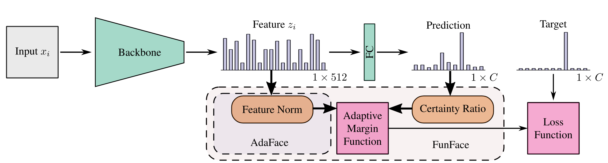
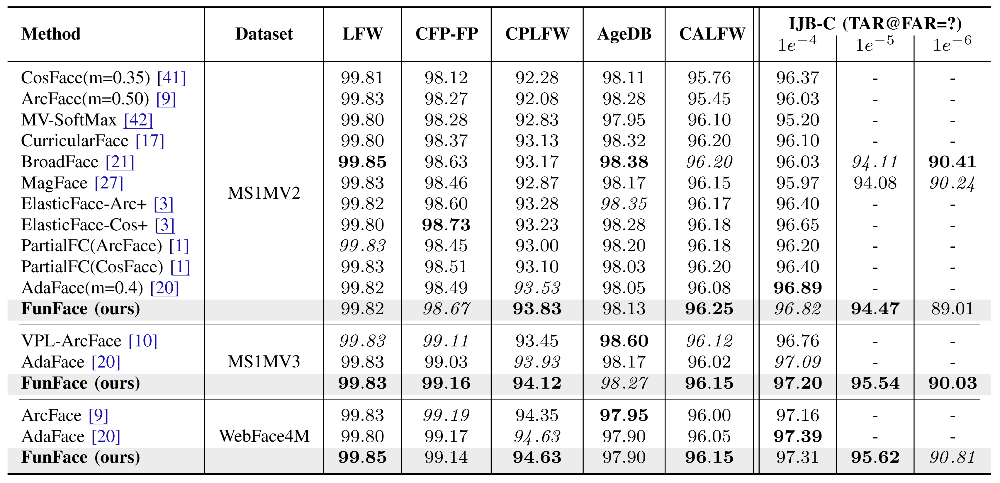
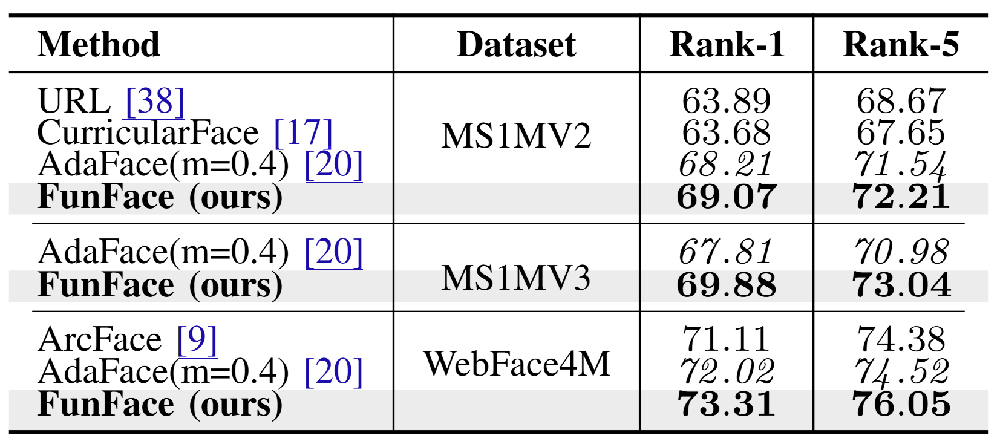
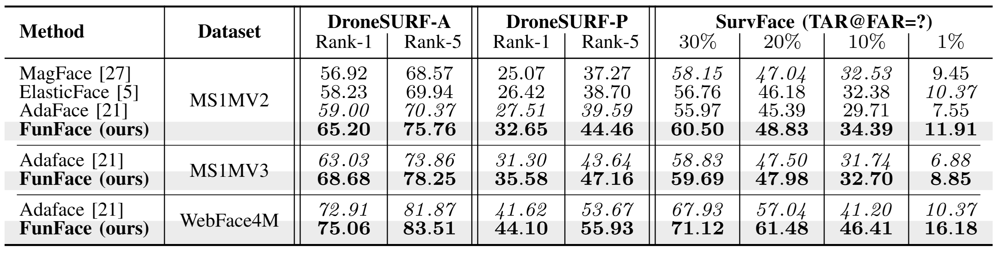

# Official repository of the paper: "FunFace: Feature Utility and Norm Estimation for Face Recognition".


This is the official repository of the paper ["FunFace: Feature Utility and Norm Estimation for Face Recognition"](https://lmi.fe.uni-lj.si/wp-content/uploads/2026/04/qFR_paper.pdf) presented at the International Conference on Automatic Face and Gesture Recognition (FG 2026) in Kyoto, Japan.


### TODO list:


- :white_check_mark: ~~Add model code and weights.~~
- :white_check_mark: ~~Add training script.~~
- :x: Add evaluation data and code.

---

## Table of Contents 

- [Official repository of the paper: "FunFace: Feature Utility and Norm Estimation for Face Recognition".](#official-repository-of-the-paper-funface-feature-utility-and-norm-estimation-for-face-recognition)
    - [TODO list:](#todo-list)
  - [Table of Contents](#table-of-contents)
  - [1. Overview](#1-overview)
    - [1.1 Abstract](#11-abstract)
    - [1.2 Methodology](#12-methodology)
    - [1.3 Results](#13-results)
  - [2. Setup](#2-setup)
    - [2.1 Environment](#21-environment)
    - [2.2 Training](#22-training)
    - [2.3 Inference](#23-inference)
    - [2.4 Pretrained Weights for Inference](#24-pretrained-weights-for-inference)
  - [3. Citation](#3-citation)


## 1. Overview

### 1.1 Abstract

Face Recognition (FR) is used in a variety of application domains, from entertainment and banking to security, and surveillance. Such applications rely on the FR model to be robust and perform well in a variety of settings. To achieve this, state-of-the-art FR models typically use expressive adaptive margin loss functions, which tie the feature norm to concepts related to sample quality, such as recognizability and perceptual image quality. Recently, through the development of Face Image Quality Assessment (FIQA) techniques, biometric utility has become the preferred measure of face-image quality and has been shown to be a better predictor of the usefulness of samples for face recognition compared to more human-centric aspects, such as resolution, blur, and lighting, tied to general image quality. While image quality expressed through feature norms exhibits a certain level of correlation with biometric utility, it does not fully encapsulate all aspects of utility. To address this point, we propose a new adaptive margin loss, FunFace (Face Recognition Through Utility and Norm Estimation), which incorporates biometric utility, estimated by the Certainty Ratio, into the adaptive margin, taking inspiration from AdaFace. We show that FunFace (when used to train a face recognition model) achieves competitive results to other state-of-the-art FR models on benchmarks containing high-quality samples, while surpassing them on low quality benchmarks.

### 1.2 Methodology



__Overview of the proposed FunFace loss function__. We extend the AdaFace framework, which adapts the margin
according to the measured feature norm, with additional information extracted from the class similarities in the form of the
Certainty Ratio. Both the feature norm and certainty ratio are combined to form the final margin value. This allows the
final loss to distinguish between samples with varying feature norms as AdaFace, while providing better angular separation,
which more closely follows the biometric utility of individual samples.

### 1.3 Results

    Experimental results on low and medium difficulty benchmarks. For the low difficulty bencmarks the results
    are presented using the verification accuracy (%), and for the mixed difficulty using the True Acceptance Rate (TAR) at
    three False Acceptance Rates (FARs): 1e−4, 1e−5, 1e−6. For each training dataset, we mark the best, and second-best result.



    Experimental results on the TinyFace benchmark. We present the Rank-1 and Rank-5 scores for each
    training dataset; we mark the best and second-best result.



    Experimental results on the high difficulty DroneSURF and SurvFace benchmarks. We present the RankN(%) score for DroneSURF and the True Acceptance Rate (TAR) at 30%, 20%, 10%, 1% False Acceptance Rates (FARs).



## 2. Setup


### 2.1 Environment 

We suggest using [conda](https://www.anaconda.com/docs/getting-started/miniconda/main), for easier environment setup.

- Create a new conda environment:
```
  conda create -n funface python=3.10
  conda activate funface
```
- Install PyTorch and TorchVision for your platform from the official selector at [pytorch.org](https://pytorch.org/get-started/locally/). For example, for CUDA 12.4:
```
  pip install torch torchvision --index-url https://download.pytorch.org/whl/cu124
```

- Install the remaining Python dependencies:
```
  pip install -r requirements.txt
```

- Python dependencies used by the repository:
  - `accelerate`
  - `braceexpand`
  - `numpy`
  - `PyYAML`
  - `scikit-learn`
  - `wandb`
  - `webdataset`

- System dependency:
  - `curl` must be available on `PATH`, because the training pipeline streams WebDataset shards through `pipe:curl ...`.

### 2.2 Training 

You can start training either through the convenience wrapper or by calling the training entrypoint directly.

With the default training config:
```bash
bash src/run_train.sh
```

With an explicit config file:
```bash
bash src/run_train.sh -c src/configs/train_default_webface4m.yaml
```

Without the wrapper:
```bash
accelerate launch src/train.py -c src/configs/train_default_webface4m.yaml
```

Some important config fields to review before launching:
- `accelerator_config`, `dataset_config`, and `augmentation_config` point to the three YAML files that define runtime, data, and augmentation settings.
- `save_loc`, `resume`, and `checkpoint` control where checkpoints are written and whether training starts fresh or resumes.

The default dataset config expects the WebFace4M training set and validates on `lfw`, `cplfw`, and `xqlfw`.

### 2.3 Inference

Inference extracts embeddings from one or more images and stores them in a pickle file.

With the default inference config:
```bash
bash src/run_inference.sh
```

With an explicit config file:
```bash
bash src/run_inference.sh -c src/configs/inference_default.yaml
```

Without the wrapper:
```bash
python3 src/inference.py -c src/configs/inference_default.yaml
```

Some important config fields to review before launching:
- `weights_path` must point to the feature extractor checkpoint you want to use.
- `input_images` accepts individual files or directories, and `recursive` controls whether nested folders are scanned.
- `output_pickle`, `device`, `device_id`, and `mixed_precision` control where embeddings are saved and which hardware/precision mode is used.

### 2.4 Pretrained Weights for Inference

Download the pretrained feature extractor checkpoint from [here](https://unilj-my.sharepoint.com/:u:/g/personal/zbabnik_fe1_uni-lj_si/IQA00fgiftoeQpERSoAGcpGnAfEOQ-GaGOD1wwIpacR9u7U?e=wb82ji).

Place the downloaded file under `src/weights` and name it `feature_extractor.pth` so it matches the default inference config:

```bash
mkdir -p src/weights
mv /path/to/downloaded_checkpoint.pth src/weights/feature_extractor.pth
```

The default inference config already points to this location:

```yaml
weights_path: "src/weights/feature_extractor.pth"
```

If you keep the checkpoint under a different name or location, update `weights_path` in `src/configs/inference_default.yaml` accordingly.

## 3. Citation

If you use this repository, please cite the paper:

- [FunFace: Feature Utility and Norm Estimation for Face Recognition](https://arxiv.org/abs/2604.26598)

```bibtex
@article{babnik2026funface,
  title={FunFace: Feature Utility and Norm Estimation for Face Recognition},
  author={{\v Z}iga Babnik and Fadi Boutros and Naser Damer and Deepak Kumar Jain and Peter Peer and Vitomir {{\v S}truc}},
  journal={arXiv preprint arXiv:2604.26598},
  year={2026}
}
```
